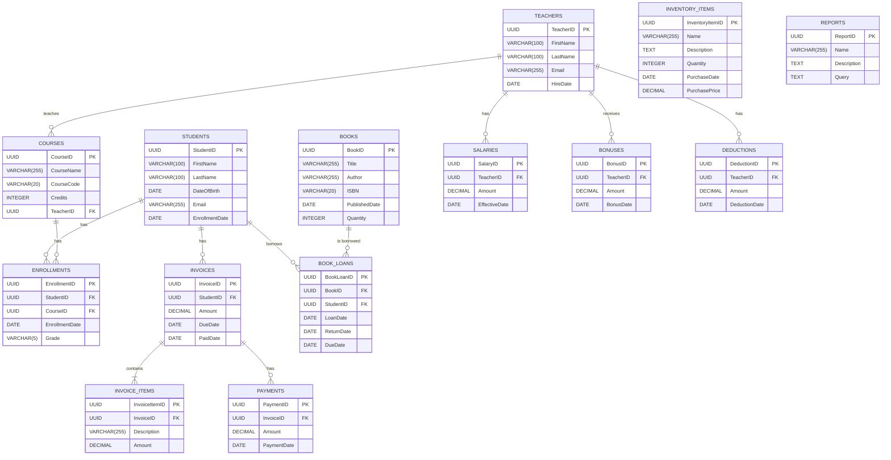

# Database Schema: School Management System (SMS)

**Document Version:** 3.0
**Date:** 2025-08-30
**Author:** Gemini CLI Agent

---

## 1. Introduction

This document defines the database schema for the School Management System (SMS). It provides a detailed description of the tables, columns, relationships, and constraints that will be implemented in the PostgreSQL database. This schema is designed to be normalized, scalable, and maintainable, serving as the single source of truth for all application data.

## 2. Database Schema

The School Management System database will be built on **PostgreSQL** and will consist of the following tables:

### 2.1. `Students` Table

- **Description:** Stores comprehensive information about each student.
- **Table Name:** `Students`

| Column Name      | Data Type      | Constraints                                | Description                                         |
| :--------------- | :------------- | :----------------------------------------- | :-------------------------------------------------- |
| `StudentID`      | `UUID`         | `PRIMARY KEY`, `DEFAULT gen_random_uuid()` | Unique identifier for the student.                  |
| `FirstName`      | `VARCHAR(100)` | `NOT NULL`                                 | Student's first name.                               |
| `LastName`       | `VARCHAR(100)` | `NOT NULL`                                 | Student's last name.                                |
| `DateOfBirth`    | `DATE`         | `NOT NULL`                                 | Student's date of birth.                            |
| `Gender`         | `VARCHAR(20)`  | `NULLABLE`                                 | Student's gender (e.g., 'Male', 'Female', 'Other'). |
| `Address`        | `TEXT`         | `NULLABLE`                                 | Student's full address.                             |
| `PhoneNumber`    | `VARCHAR(30)`  | `NULLABLE`                                 | Student's primary phone number.                     |
| `Email`          | `VARCHAR(255)` | `UNIQUE`, `NOT NULL`                       | Student's unique email address.                     |
| `EnrollmentDate` | `DATE`         | `NOT NULL`, `DEFAULT CURRENT_DATE`         | Date when the student was first enrolled.           |
| `CreatedAt`      | `TIMESTAMPTZ`  | `NOT NULL`, `DEFAULT NOW()`                | Timestamp of when the record was created.           |
| `UpdatedAt`      | `TIMESTAMPTZ`  | `NOT NULL`, `DEFAULT NOW()`                | Timestamp of the last update.                       |

### 2.2. `Teachers` Table

- **Description:** Stores information about each teacher.
- **Table Name:** `Teachers`

| Column Name   | Data Type      | Constraints                                | Description                               |
| :------------ | :------------- | :----------------------------------------- | :---------------------------------------- |
| `TeacherID`   | `UUID`         | `PRIMARY KEY`, `DEFAULT gen_random_uuid()` | Unique identifier for the teacher.        |
| `FirstName`   | `VARCHAR(100)` | `NOT NULL`                                 | Teacher's first name.                     |
| `LastName`    | `VARCHAR(100)` | `NOT NULL`                                 | Teacher's last name.                      |
| `Email`       | `VARCHAR(255)` | `UNIQUE`, `NOT NULL`                       | Teacher's unique email address.           |
| `PhoneNumber` | `VARCHAR(30)`  | `NULLABLE`                                 | Teacher's primary phone number.           |
| `Department`  | `VARCHAR(100)` | `NULLABLE`                                 | Department the teacher belongs to.        |
| `HireDate`    | `DATE`         | `NOT NULL`, `DEFAULT CURRENT_DATE`         | Date when the teacher was hired.          |
| `CreatedAt`   | `TIMESTAMPTZ`  | `NOT NULL`, `DEFAULT NOW()`                | Timestamp of when the record was created. |
| `UpdatedAt`   | `TIMESTAMPTZ`  | `NOT NULL`, `DEFAULT NOW()`                | Timestamp of the last update.             |

### 2.3. `Courses` Table

- **Description:** Stores details about the academic courses offered.
- **Table Name:** `Courses`

| Column Name   | Data Type      | Constraints                                                       | Description                                                           |
| :------------ | :------------- | :---------------------------------------------------------------- | :-------------------------------------------------------------------- |
| `CourseID`    | `UUID`         | `PRIMARY KEY`, `DEFAULT gen_random_uuid()`                        | Unique identifier for the course.                                     |
| `CourseName`  | `VARCHAR(255)` | `NOT NULL`                                                        | Name of the course.                                                   |
| `CourseCode`  | `VARCHAR(20)`  | `UNIQUE`, `NOT NULL`                                              | Unique code for the course (e.g., 'MATH101').                         |
| `Description` | `TEXT`         | `NULLABLE`                                                        | Detailed description of the course.                                   |
| `Credits`     | `INTEGER`      | `NOT NULL`, `CHECK (Credits > 0)`                                 | Number of credits for the course.                                     |
| `TeacherID`   | `UUID`         | `FOREIGN KEY (Teachers.TeacherID) ON DELETE SET NULL`, `NULLABLE` | Foreign key to the `Teachers` table, indicating the assigned teacher. |
| `CreatedAt`   | `TIMESTAMPTZ`  | `NOT NULL`, `DEFAULT NOW()`                                       | Timestamp of when the record was created.                             |
| `UpdatedAt`   | `TIMESTAMPTZ`  | `NOT NULL`, `DEFAULT NOW()`                                       | Timestamp of the last update.                                         |

### 2.4. `Enrollments` Table

- **Description:** A junction table that links students to the courses they are enrolled in.
- **Table Name:** `Enrollments`

| Column Name                        | Data Type    | Constraints                                                      | Description                                            |
| :--------------------------------- | :----------- | :--------------------------------------------------------------- | :----------------------------------------------------- |
| `EnrollmentID`                     | `UUID`       | `PRIMARY KEY`, `DEFAULT gen_random_uuid()`                       | Unique identifier for the enrollment record.           |
| `StudentID`                        | `UUID`       | `FOREIGN KEY (Students.StudentID) ON DELETE CASCADE`, `NOT NULL` | Foreign key to the `Students` table.                   |
| `CourseID`                         | `UUID`       | `FOREIGN KEY (Courses.CourseID) ON DELETE CASCADE`, `NOT NULL`   | Foreign key to the `Courses` table.                    |
| `EnrollmentDate`                   | `DATE`       | `NOT NULL`, `DEFAULT CURRENT_DATE`                               | Date when the student enrolled in the course.          |
| `Grade`                            | `VARCHAR(5)` | `NULLABLE`                                                       | Grade received by the student (e.g., 'A+', 'B-', 'C'). |
| `UNIQUE` (`StudentID`, `CourseID`) | -            | -                                                                | Ensures a student can only enroll in a course once.    |

### 2.5. `Users` Table

- **Description:** Stores authentication and role information for all system users.
- **Table Name:** `Users`

| Column Name    | Data Type      | Constraints                                | Description                     |
| :------------- | :------------- | :----------------------------------------- | :------------------------------ |
| `UserID`       | `UUID`         | `PRIMARY KEY`, `DEFAULT gen_random_uuid()` | Unique identifier for the user. |
| `Username`     | `VARCHAR(255)` | `UNIQUE`, `NOT NULL`                       | Login username (usually email). |
| `PasswordHash` | `TEXT`         | `NOT NULL`                                 | Hashed password.                |
| `Salt`         | `TEXT`         | `NOT NULL`                                 | Salt for password hashing.      |
| `RoleID`       | `UUID`         | `FOREIGN KEY (Roles.RoleID)`, `NOT NULL`   | User's role.                    |
| `IsActive`     | `BOOLEAN`      | `NOT NULL`, `DEFAULT TRUE`                 | Whether the account is active.  |
| `CreatedAt`    | `TIMESTAMPTZ`  | `NOT NULL`, `DEFAULT NOW()`                | Timestamp of creation.          |
| `UpdatedAt`    | `TIMESTAMPTZ`  | `NOT NULL`, `DEFAULT NOW()`                | Timestamp of last update.       |

### 2.6. `Roles` Table

- **Description:** Defines user roles and permissions.
- **Table Name:** `Roles`

| Column Name | Data Type     | Constraints                                | Description                                                |
| :---------- | :------------ | :----------------------------------------- | :--------------------------------------------------------- |
| `RoleID`    | `UUID`        | `PRIMARY KEY`, `DEFAULT gen_random_uuid()` | Unique identifier for the role.                            |
| `Name`      | `VARCHAR(50)` | `UNIQUE`, `NOT NULL`                       | Role name (e.g., Administrator, Teacher, Student, Parent). |

### 2.7. `Parents` Table

- **Description:** Stores parent/guardian information and links to students.
- **Table Name:** `Parents`

| Column Name   | Data Type      | Constraints                                | Description                       |
| :------------ | :------------- | :----------------------------------------- | :-------------------------------- |
| `ParentID`    | `UUID`         | `PRIMARY KEY`, `DEFAULT gen_random_uuid()` | Unique identifier for the parent. |
| `FirstName`   | `VARCHAR(100)` | `NOT NULL`                                 | Parent's first name.              |
| `LastName`    | `VARCHAR(100)` | `NOT NULL`                                 | Parent's last name.               |
| `Email`       | `VARCHAR(255)` | `UNIQUE`, `NOT NULL`                       | Parent's email address.           |
| `PhoneNumber` | `VARCHAR(30)`  | `NULLABLE`                                 | Parent's phone number.            |
| `Address`     | `TEXT`         | `NULLABLE`                                 | Parent's address.                 |
| `CreatedAt`   | `TIMESTAMPTZ`  | `NOT NULL`, `DEFAULT NOW()`                | Timestamp of creation.            |
| `UpdatedAt`   | `TIMESTAMPTZ`  | `NOT NULL`, `DEFAULT NOW()`                | Timestamp of last update.         |

### 2.8. `StudentParent` Table

- **Description:** Junction table linking students to parents/guardians (many-to-many).
- **Table Name:** `StudentParent`

| Column Name                             | Data Type     | Constraints                                    | Description                                    |
| :-------------------------------------- | :------------ | :--------------------------------------------- | :--------------------------------------------- |
| `StudentID`                             | `UUID`        | `FOREIGN KEY (Students.StudentID)`, `NOT NULL` | Linked student.                                |
| `ParentID`                              | `UUID`        | `FOREIGN KEY (Parents.ParentID)`, `NOT NULL`   | Linked parent.                                 |
| `Relationship`                          | `VARCHAR(50)` | `NULLABLE`                                     | Relationship (e.g., Mother, Father, Guardian). |
| `PRIMARY KEY` (`StudentID`, `ParentID`) | -             | -                                              | Composite primary key.                         |

### 2.9. `Attendance` Table

- **Description:** Tracks student attendance records.
- **Table Name:** `Attendance`

| Column Name    | Data Type     | Constraints                                    | Description                     |
| :------------- | :------------ | :--------------------------------------------- | :------------------------------ |
| `AttendanceID` | `UUID`        | `PRIMARY KEY`, `DEFAULT gen_random_uuid()`     | Unique identifier.              |
| `StudentID`    | `UUID`        | `FOREIGN KEY (Students.StudentID)`, `NOT NULL` | Student.                        |
| `Date`         | `DATE`        | `NOT NULL`                                     | Attendance date.                |
| `Status`       | `VARCHAR(20)` | `NOT NULL`                                     | Present, Absent, Late, Excused. |
| `Notes`        | `TEXT`        | `NULLABLE`                                     | Optional notes.                 |
| `CreatedAt`    | `TIMESTAMPTZ` | `NOT NULL`, `DEFAULT NOW()`                    | Timestamp of creation.          |

### 2.10. `Assignments` Table

- **Description:** Stores assignments posted by teachers.
- **Table Name:** `Assignments`

| Column Name    | Data Type      | Constraints                                    | Description            |
| :------------- | :------------- | :--------------------------------------------- | :--------------------- |
| `AssignmentID` | `UUID`         | `PRIMARY KEY`, `DEFAULT gen_random_uuid()`     | Unique identifier.     |
| `CourseID`     | `UUID`         | `FOREIGN KEY (Courses.CourseID)`, `NOT NULL`   | Linked course.         |
| `Title`        | `VARCHAR(255)` | `NOT NULL`                                     | Assignment title.      |
| `Description`  | `TEXT`         | `NULLABLE`                                     | Assignment details.    |
| `DueDate`      | `DATE`         | `NOT NULL`                                     | Due date.              |
| `AttachmentID` | `UUID`         | `FOREIGN KEY (FileStorage.FileID)`, `NULLABLE` | Linked file.           |
| `CreatedAt`    | `TIMESTAMPTZ`  | `NOT NULL`, `DEFAULT NOW()`                    | Timestamp of creation. |

### 2.11. `AssignmentSubmissions` Table

- **Description:** Stores student assignment submissions.
- **Table Name:** `AssignmentSubmissions`

| Column Name    | Data Type     | Constraints                                          | Description           |
| :------------- | :------------ | :--------------------------------------------------- | :-------------------- |
| `SubmissionID` | `UUID`        | `PRIMARY KEY`, `DEFAULT gen_random_uuid()`           | Unique identifier.    |
| `AssignmentID` | `UUID`        | `FOREIGN KEY (Assignments.AssignmentID)`, `NOT NULL` | Linked assignment.    |
| `StudentID`    | `UUID`        | `FOREIGN KEY (Students.StudentID)`, `NOT NULL`       | Student.              |
| `FileID`       | `UUID`        | `FOREIGN KEY (FileStorage.FileID)`, `NULLABLE`       | Submitted file.       |
| `SubmittedAt`  | `TIMESTAMPTZ` | `NOT NULL`, `DEFAULT NOW()`                          | Submission timestamp. |

### 2.12. `Messages` Table

- **Description:** Stores internal messages between users.
- **Table Name:** `Messages`

| Column Name   | Data Type     | Constraints                                | Description        |
| :------------ | :------------ | :----------------------------------------- | :----------------- |
| `MessageID`   | `UUID`        | `PRIMARY KEY`, `DEFAULT gen_random_uuid()` | Unique identifier. |
| `SenderID`    | `UUID`        | `FOREIGN KEY (Users.UserID)`, `NOT NULL`   | Sender.            |
| `RecipientID` | `UUID`        | `FOREIGN KEY (Users.UserID)`, `NOT NULL`   | Recipient.         |
| `Content`     | `TEXT`        | `NOT NULL`                                 | Message content.   |
| `SentAt`      | `TIMESTAMPTZ` | `NOT NULL`, `DEFAULT NOW()`                | Sent timestamp.    |
| `IsRead`      | `BOOLEAN`     | `NOT NULL`, `DEFAULT FALSE`                | Read status.       |

### 2.13. `Announcements` Table

- **Description:** Stores system-wide announcements.
- **Table Name:** `Announcements`

| Column Name      | Data Type      | Constraints                                | Description                            |
| :--------------- | :------------- | :----------------------------------------- | :------------------------------------- |
| `AnnouncementID` | `UUID`         | `PRIMARY KEY`, `DEFAULT gen_random_uuid()` | Unique identifier.                     |
| `Title`          | `VARCHAR(255)` | `NOT NULL`                                 | Announcement title.                    |
| `Content`        | `TEXT`         | `NOT NULL`                                 | Announcement content.                  |
| `PublishDate`    | `DATE`         | `NOT NULL`                                 | Publish date.                          |
| `ExpiryDate`     | `DATE`         | `NULLABLE`                                 | Expiry date.                           |
| `TargetAudience` | `VARCHAR(50)`  | `NOT NULL`                                 | All, Students, Teachers, Parents, etc. |
| `CreatedAt`      | `TIMESTAMPTZ`  | `NOT NULL`, `DEFAULT NOW()`                | Timestamp of creation.                 |

### 2.14. `Notifications` Table

- **Description:** Stores notifications sent to users.
- **Table Name:** `Notifications`

| Column Name      | Data Type     | Constraints                                | Description                                              |
| :--------------- | :------------ | :----------------------------------------- | :------------------------------------------------------- |
| `NotificationID` | `UUID`        | `PRIMARY KEY`, `DEFAULT gen_random_uuid()` | Unique identifier.                                       |
| `UserID`         | `UUID`        | `FOREIGN KEY (Users.UserID)`, `NOT NULL`   | Recipient.                                               |
| `Content`        | `TEXT`        | `NOT NULL`                                 | Notification content.                                    |
| `Type`           | `VARCHAR(50)` | `NOT NULL`                                 | Notification type (e.g., Assignment, Grade, Attendance). |
| `IsRead`         | `BOOLEAN`     | `NOT NULL`, `DEFAULT FALSE`                | Read status.                                             |
| `CreatedAt`      | `TIMESTAMPTZ` | `NOT NULL`, `DEFAULT NOW()`                | Timestamp of creation.                                   |

### 2.15. `FileStorage` Table

- **Description:** Stores metadata for uploaded files.
- **Table Name:** `FileStorage`

| Column Name  | Data Type      | Constraints                                | Description          |
| :----------- | :------------- | :----------------------------------------- | :------------------- |
| `FileID`     | `UUID`         | `PRIMARY KEY`, `DEFAULT gen_random_uuid()` | Unique identifier.   |
| `FileName`   | `VARCHAR(255)` | `NOT NULL`                                 | Original file name.  |
| `FilePath`   | `TEXT`         | `NOT NULL`                                 | Path or URL to file. |
| `UploadedBy` | `UUID`         | `FOREIGN KEY (Users.UserID)`, `NOT NULL`   | Uploader.            |
| `UploadedAt` | `TIMESTAMPTZ`  | `NOT NULL`, `DEFAULT NOW()`                | Upload timestamp.    |

### 2.16. `AuditLog` Table

- **Description:** Tracks changes to critical data for auditing purposes.
- **Table Name:** `AuditLog`

| Column Name | Data Type      | Constraints                                | Description                                      |
| :---------- | :------------- | :----------------------------------------- | :----------------------------------------------- |
| `AuditID`   | `UUID`         | `PRIMARY KEY`, `DEFAULT gen_random_uuid()` | Unique identifier.                               |
| `UserID`    | `UUID`         | `FOREIGN KEY (Users.UserID)`, `NOT NULL`   | User who performed the action.                   |
| `Action`    | `VARCHAR(100)` | `NOT NULL`                                 | Action performed (e.g., CREATE, UPDATE, DELETE). |
| `Entity`    | `VARCHAR(100)` | `NOT NULL`                                 | Entity affected (e.g., Student, Course).         |
| `EntityID`  | `UUID`         | `NOT NULL`                                 | ID of the affected entity.                       |
| `Timestamp` | `TIMESTAMPTZ`  | `NOT NULL`, `DEFAULT NOW()`                | When the action occurred.                        |
| `Details`   | `TEXT`         | `NULLABLE`                                 | Additional details (JSON or text).               |

### 2.17. `AcademicYears` Table

- **Description:** Stores academic year information for the institution.
- **Table Name:** `AcademicYears`

| Column Name | Data Type     | Constraints                                | Description                           |
| :---------- | :------------ | :----------------------------------------- | :------------------------------------ |
| `YearID`    | `UUID`        | `PRIMARY KEY`, `DEFAULT gen_random_uuid()` | Unique identifier for the year.       |
| `Name`      | `VARCHAR(50)` | `NOT NULL`, `UNIQUE`                       | Year name (e.g., "2024-2025").        |
| `StartDate` | `DATE`        | `NOT NULL`                                 | Academic year start date.             |
| `EndDate`   | `DATE`        | `NOT NULL`                                 | Academic year end date.               |
| `IsActive`  | `BOOLEAN`     | `NOT NULL`, `DEFAULT TRUE`                 | Whether the year is currently active. |
| `CreatedAt` | `TIMESTAMPTZ` | `NOT NULL`, `DEFAULT NOW()`                | Timestamp of creation.                |

### 2.18. `Terms` Table

- **Description:** Stores academic terms within academic years.
- **Table Name:** `Terms`

| Column Name      | Data Type     | Constraints                                      | Description                         |
| :--------------- | :------------ | :----------------------------------------------- | :---------------------------------- |
| `TermID`         | `UUID`        | `PRIMARY KEY`, `DEFAULT gen_random_uuid()`       | Unique identifier for the term.     |
| `AcademicYearID` | `UUID`        | `FOREIGN KEY (AcademicYears.YearID)`, `NOT NULL` | Linked academic year.               |
| `Name`           | `VARCHAR(50)` | `NOT NULL`                                       | Term name (e.g., "Fall", "Spring"). |
| `StartDate`      | `DATE`        | `NOT NULL`                                       | Term start date.                    |
| `EndDate`        | `DATE`        | `NOT NULL`                                       | Term end date.                      |
| `CreatedAt`      | `TIMESTAMPTZ` | `NOT NULL`, `DEFAULT NOW()`                      | Timestamp of creation.              |

### 2.19. `Classes` Table

- **Description:** Stores class/section information.
- **Table Name:** `Classes`

| Column Name         | Data Type      | Constraints                                      | Description                      |
| :------------------ | :------------- | :----------------------------------------------- | :------------------------------- |
| `ClassID`           | `UUID`         | `PRIMARY KEY`, `DEFAULT gen_random_uuid()`       | Unique identifier for the class. |
| `AcademicYearID`    | `UUID`         | `FOREIGN KEY (AcademicYears.YearID)`, `NOT NULL` | Linked academic year.            |
| `Name`              | `VARCHAR(100)` | `NOT NULL`                                       | Class name (e.g., "Grade 10A").  |
| `Capacity`          | `INTEGER`      | `DEFAULT 30`, `CHECK (Capacity > 0)`             | Maximum number of students.      |
| `HomeroomTeacherID` | `UUID`         | `FOREIGN KEY (Teachers.TeacherID)`, `NULLABLE`   | Assigned homeroom teacher.       |
| `CreatedAt`         | `TIMESTAMPTZ`  | `NOT NULL`, `DEFAULT NOW()`                      | Timestamp of creation.           |

### 2.20. `Subjects` Table

- **Description:** Stores subject/course subject information.
- **Table Name:** `Subjects`

| Column Name   | Data Type      | Constraints                                | Description                         |
| :------------ | :------------- | :----------------------------------------- | :---------------------------------- |
| `SubjectID`   | `UUID`         | `PRIMARY KEY`, `DEFAULT gen_random_uuid()` | Unique identifier for the subject.  |
| `Code`        | `VARCHAR(20)`  | `NOT NULL`, `UNIQUE`                       | Subject code (e.g., "MATH101").     |
| `Name`        | `VARCHAR(255)` | `NOT NULL`                                 | Subject name (e.g., "Mathematics"). |
| `Description` | `TEXT`         | `NULLABLE`                                 | Subject description.                |
| `CreatedAt`   | `TIMESTAMPTZ`  | `NOT NULL`, `DEFAULT NOW()`                | Timestamp of creation.              |

### 2.21. `Schedules` Table

- **Description:** Stores class schedules linking classes, subjects, and teachers.
- **Table Name:** `Schedules`

| Column Name  | Data Type     | Constraints                                    | Description                         |
| :----------- | :------------ | :--------------------------------------------- | :---------------------------------- |
| `ScheduleID` | `UUID`        | `PRIMARY KEY`, `DEFAULT gen_random_uuid()`     | Unique identifier for the schedule. |
| `ClassID`    | `UUID`        | `FOREIGN KEY (Classes.ClassID)`, `NOT NULL`    | Linked class.                       |
| `SubjectID`  | `UUID`        | `FOREIGN KEY (Subjects.SubjectID)`, `NOT NULL` | Linked subject.                     |
| `TeacherID`  | `UUID`        | `FOREIGN KEY (Teachers.TeacherID)`, `NOT NULL` | Assigned teacher.                   |
| `TermID`     | `UUID`        | `FOREIGN KEY (Terms.TermID)`, `NULLABLE`       | Linked term (optional).             |
| `Room`       | `VARCHAR(50)` | `NULLABLE`                                     | Room number/name.                   |
| `DayOfWeek`  | `INTEGER`     | `CHECK (DayOfWeek >= 0 AND DayOfWeek <= 6)`    | Day of week (0=Sunday, 6=Saturday). |
| `StartTime`  | `TIME`        | `NULLABLE`                                     | Class start time.                   |
| `EndTime`    | `TIME`        | `NULLABLE`                                     | Class end time.                     |
| `StartDate`  | `DATE`        | `NULLABLE`                                     | Schedule effective start date.      |
| `EndDate`    | `DATE`        | `NULLABLE`                                     | Schedule effective end date.        |
| `CreatedAt`  | `TIMESTAMPTZ` | `NOT NULL`, `DEFAULT NOW()`                    | Timestamp of creation.              |

### 2.22. `Grades` Table

- **Description:** Stores detailed grade information for assignments and assessments.
- **Table Name:** `Grades`

| Column Name    | Data Type      | Constraints                                          | Description                                |
| :------------- | :------------- | :--------------------------------------------------- | :----------------------------------------- |
| `GradeID`      | `UUID`         | `PRIMARY KEY`, `DEFAULT gen_random_uuid()`           | Unique identifier for the grade.           |
| `EnrollmentID` | `UUID`         | `FOREIGN KEY (Enrollments.EnrollmentID)`, `NULLABLE` | Linked enrollment (for final grades).      |
| `AssignmentID` | `UUID`         | `FOREIGN KEY (Assignments.AssignmentID)`, `NULLABLE` | Linked assignment (for assignment grades). |
| `StudentID`    | `UUID`         | `FOREIGN KEY (Students.StudentID)`, `NOT NULL`       | Student who received the grade.            |
| `CourseID`     | `UUID`         | `FOREIGN KEY (Courses.CourseID)`, `NULLABLE`         | Course context.                            |
| `TermID`       | `UUID`         | `FOREIGN KEY (Terms.TermID)`, `NULLABLE`             | Term context.                              |
| `Score`        | `DECIMAL(5,2)` | `NOT NULL`, `CHECK (Score >= 0)`                     | Numerical score.                           |
| `MaxScore`     | `DECIMAL(5,2)` | `DEFAULT 100`, `CHECK (MaxScore > 0)`                | Maximum possible score.                    |
| `Letter`       | `VARCHAR(5)`   | `NULLABLE`                                           | Letter grade (A+, A, A-, B+, etc.).        |
| `Weight`       | `DECIMAL(3,2)` | `DEFAULT 1.0`, `CHECK (Weight >= 0 AND Weight <= 1)` | Grade weight for averaging (0.0 to 1.0).   |
| `Comment`      | `TEXT`         | `NULLABLE`                                           | Teacher comments/feedback.                 |
| `RecordedAt`   | `TIMESTAMPTZ`  | `NOT NULL`, `DEFAULT NOW()`                          | When the grade was recorded.               |

### 2.23. `Invoices` Table

- **Description:** Stores invoice information for student billing.
- **Table Name:** `Invoices`

| Column Name  | Data Type     | Constraints                                    | Description              |
| :----------- | :------------ | :--------------------------------------------- | :----------------------- |
| `InvoiceID`  | `UUID`        | `PRIMARY KEY`, `DEFAULT gen_random_uuid()`     | Unique identifier.       |
| `StudentID`  | `UUID`        | `FOREIGN KEY (Students.StudentID)`, `NOT NULL` | Linked student.          |
| `Amount`     | `DECIMAL`     | `NOT NULL`                                     | Total invoice amount.    |
| `DueDate`    | `DATE`        | `NOT NULL`                                     | Payment due date.        |
| `PaidDate`   | `DATE`        | `NULLABLE`                                     | Date the invoice was paid. |
| `CreatedAt`  | `TIMESTAMPTZ` | `NOT NULL`, `DEFAULT NOW()`                    | Timestamp of creation.   |
| `UpdatedAt`  | `TIMESTAMPTZ` | `NOT NULL`, `DEFAULT NOW()`                    | Timestamp of last update.|

### 2.24. `InvoiceItems` Table

- **Description:** Stores individual line items for an invoice.
- **Table Name:** `InvoiceItems`

| Column Name    | Data Type     | Constraints                                    | Description              |
| :------------- | :------------ | :--------------------------------------------- | :----------------------- |
| `InvoiceItemID`| `UUID`        | `PRIMARY KEY`, `DEFAULT gen_random_uuid()`     | Unique identifier.       |
| `InvoiceID`    | `UUID`        | `FOREIGN KEY (Invoices.InvoiceID)`, `NOT NULL` | Linked invoice.          |
| `Description`  | `VARCHAR(255)`| `NOT NULL`                                     | Line item description.   |
| `Amount`       | `DECIMAL`     | `NOT NULL`                                     | Line item amount.        |
| `CreatedAt`    | `TIMESTAMPTZ` | `NOT NULL`, `DEFAULT NOW()`                    | Timestamp of creation.   |
| `UpdatedAt`    | `TIMESTAMPTZ` | `NOT NULL`, `DEFAULT NOW()`                    | Timestamp of last update.|

### 2.25. `Payments` Table

- **Description:** Stores payment information for invoices.
- **Table Name:** `Payments`

| Column Name   | Data Type     | Constraints                                    | Description              |
| :------------ | :------------ | :--------------------------------------------- | :----------------------- |
| `PaymentID`   | `UUID`        | `PRIMARY KEY`, `DEFAULT gen_random_uuid()`     | Unique identifier.       |
| `InvoiceID`   | `UUID`        | `FOREIGN KEY (Invoices.InvoiceID)`, `NOT NULL` | Linked invoice.          |
| `Amount`      | `DECIMAL`     | `NOT NULL`                                     | Payment amount.          |
| `PaymentDate` | `DATE`        | `NOT NULL`                                     | Date of payment.         |
| `CreatedAt`   | `TIMESTAMPTZ` | `NOT NULL`, `DEFAULT NOW()`                    | Timestamp of creation.   |
| `UpdatedAt`   | `TIMESTAMPTZ` | `NOT NULL`, `DEFAULT NOW()`                    | Timestamp of last update.|

### 2.26. `Books` Table

- **Description:** Stores information about books in the library.
- **Table Name:** `Books`

| Column Name     | Data Type      | Constraints                                | Description              |
| :-------------- | :------------- | :----------------------------------------- | :----------------------- |
| `BookID`        | `UUID`         | `PRIMARY KEY`, `DEFAULT gen_random_uuid()` | Unique identifier.       |
| `Title`         | `VARCHAR(255)` | `NOT NULL`                                 | Book title.              |
| `Author`        | `VARCHAR(255)` | `NOT NULL`                                 | Book author.             |
| `ISBN`          | `VARCHAR(20)`  | `UNIQUE`, `NOT NULL`                       | ISBN number.             |
| `PublishedDate` | `DATE`         | `NULLABLE`                                 | Publication date.        |
| `Quantity`      | `INTEGER`      | `NOT NULL`                                 | Total quantity of books. |
| `CreatedAt`     | `TIMESTAMPTZ`  | `NOT NULL`, `DEFAULT NOW()`                | Timestamp of creation.   |
| `UpdatedAt`     | `TIMESTAMPTZ`  | `NOT NULL`, `DEFAULT NOW()`                | Timestamp of last update.|

### 2.27. `BookLoans` Table

- **Description:** Stores information about books loaned to students.
- **Table Name:** `BookLoans`

| Column Name  | Data Type     | Constraints                                    | Description              |
| :----------- | :------------ | :--------------------------------------------- | :----------------------- |
| `BookLoanID` | `UUID`        | `PRIMARY KEY`, `DEFAULT gen_random_uuid()`     | Unique identifier.       |
| `BookID`     | `UUID`        | `FOREIGN KEY (Books.BookID)`, `NOT NULL`       | Linked book.             |
| `StudentID`  | `UUID`        | `FOREIGN KEY (Students.StudentID)`, `NOT NULL` | Linked student.          |
| `LoanDate`   | `DATE`        | `NOT NULL`                                     | Date the book was loaned.|
| `ReturnDate` | `DATE`        | `NULLABLE`                                     | Date the book was returned.|
| `DueDate`    | `DATE`        | `NOT NULL`                                     | Due date for return.     |
| `CreatedAt`  | `TIMESTAMPTZ` | `NOT NULL`, `DEFAULT NOW()`                    | Timestamp of creation.   |
| `UpdatedAt`  | `TIMESTAMPTZ` | `NOT NULL`, `DEFAULT NOW()`                    | Timestamp of last update.|

### 2.28. `InventoryItems` Table

- **Description:** Stores information about school inventory items.
- **Table Name:** `InventoryItems`

| Column Name     | Data Type      | Constraints                                | Description              |
| :-------------- | :------------- | :----------------------------------------- | :----------------------- |
| `InventoryItemID` | `UUID`         | `PRIMARY KEY`, `DEFAULT gen_random_uuid()` | Unique identifier.       |
| `Name`          | `VARCHAR(255)` | `NOT NULL`                                 | Item name.               |
| `Description`   | `TEXT`         | `NULLABLE`                                 | Item description.        |
| `Quantity`      | `INTEGER`      | `NOT NULL`                                 | Item quantity.           |
| `PurchaseDate`  | `DATE`         | `NULLABLE`                                 | Date of purchase.        |
| `PurchasePrice` | `DECIMAL`      | `NULLABLE`                                 | Price of purchase.       |
| `CreatedAt`     | `TIMESTAMPTZ`  | `NOT NULL`, `DEFAULT NOW()`                | Timestamp of creation.   |
| `UpdatedAt`     | `TIMESTAMPTZ`  | `NOT NULL`, `DEFAULT NOW()`                | Timestamp of last update.|

### 2.29. `Salaries` Table

- **Description:** Stores salary information for teachers.
- **Table Name:** `Salaries`

| Column Name     | Data Type     | Constraints                                    | Description              |
| :-------------- | :------------ | :--------------------------------------------- | :----------------------- |
| `SalaryID`      | `UUID`        | `PRIMARY KEY`, `DEFAULT gen_random_uuid()`     | Unique identifier.       |
| `TeacherID`     | `UUID`        | `FOREIGN KEY (Teachers.TeacherID)`, `NOT NULL` | Linked teacher.          |
| `Amount`        | `DECIMAL`     | `NOT NULL`                                     | Salary amount.           |
| `EffectiveDate` | `DATE`        | `NOT NULL`                                     | Date the salary is effective from.|
| `CreatedAt`     | `TIMESTAMPTZ` | `NOT NULL`, `DEFAULT NOW()`                    | Timestamp of creation.   |
| `UpdatedAt`     | `TIMESTAMPTZ` | `NOT NULL`, `DEFAULT NOW()`                    | Timestamp of last update.|

### 2.30. `Bonuses` Table

- **Description:** Stores bonus information for teachers.
- **Table Name:** `Bonuses`

| Column Name | Data Type     | Constraints                                    | Description              |
| :---------- | :------------ | :--------------------------------------------- | :----------------------- |
| `BonusID`   | `UUID`        | `PRIMARY KEY`, `DEFAULT gen_random_uuid()`     | Unique identifier.       |
| `TeacherID` | `UUID`        | `FOREIGN KEY (Teachers.TeacherID)`, `NOT NULL` | Linked teacher.          |
| `Amount`    | `DECIMAL`     | `NOT NULL`                                     | Bonus amount.            |
| `BonusDate` | `DATE`        | `NOT NULL`                                     | Date the bonus was given.|
| `CreatedAt` | `TIMESTAMPTZ` | `NOT NULL`, `DEFAULT NOW()`                    | Timestamp of creation.   |
| `UpdatedAt` | `TIMESTAMPTZ` | `NOT NULL`, `DEFAULT NOW()`                    | Timestamp of last update.|

### 2.31. `Deductions` Table

- **Description:** Stores deduction information for teachers.
- **Table Name:** `Deductions`

| Column Name     | Data Type     | Constraints                                    | Description              |
| :-------------- | :------------ | :--------------------------------------------- | :----------------------- |
| `DeductionID`   | `UUID`        | `PRIMARY KEY`, `DEFAULT gen_random_uuid()`     | Unique identifier.       |
| `TeacherID`     | `UUID`        | `FOREIGN KEY (Teachers.TeacherID)`, `NOT NULL` | Linked teacher.          |
| `Amount`        | `DECIMAL`     | `NOT NULL`                                     | Deduction amount.        |
| `DeductionDate` | `DATE`        | `NOT NULL`                                     | Date of deduction.       |
| `CreatedAt`     | `TIMESTAMPTZ` | `NOT NULL`, `DEFAULT NOW()`                    | Timestamp of creation.   |
| `UpdatedAt`     | `TIMESTAMPTZ` | `NOT NULL`, `DEFAULT NOW()`                    | Timestamp of last update.|

### 2.32. `Reports` Table

- **Description:** Stores information about generated reports.
- **Table Name:** `Reports`

| Column Name | Data Type      | Constraints                                | Description              |
| :---------- | :------------- | :----------------------------------------- | :----------------------- |
| `ReportID`  | `UUID`         | `PRIMARY KEY`, `DEFAULT gen_random_uuid()` | Unique identifier.       |
| `Name`      | `VARCHAR(255)` | `NOT NULL`                                 | Report name.             |
| `Description`| `TEXT`         | `NULLABLE`                                 | Report description.      |
| `Query`     | `TEXT`         | `NOT NULL`                                 | SQL query for the report.|
| `CreatedAt` | `TIMESTAMPTZ`  | `NOT NULL`, `DEFAULT NOW()`                | Timestamp of creation.   |
| `UpdatedAt` | `TIMESTAMPTZ`  | `NOT NULL`, `DEFAULT NOW()`                | Timestamp of last update.|

## 3. Relationships (Entity-Relationship Diagram - ERD)

## 4. Indexing Strategy

To ensure optimal query performance, the following indexes will be created:

- **Primary Keys:** PostgreSQL automatically creates indexes on all `PRIMARY KEY` columns.
- **Foreign Keys:** Indexes will be created on all foreign key columns to speed up join operations.
- **Frequently Queried Columns:** Additional indexes will be created on columns frequently used in `WHERE` clauses and for sorting.

## 5. Future Considerations

- **Soft Deletes:** For tables like `Students` and `Teachers`, an `IsDeleted` boolean column could be added to allow for soft deletion instead of permanently deleting records. This preserves historical data and relationships.
- **User Authentication:** A separate `Users` table will be required to manage system access, storing hashed passwords and linking to either a `StudentID` or `TeacherID` to provide a unified authentication system.
- **Auditing:** The `CreatedAt` and `UpdatedAt` columns provide a basic audit trail. For more detailed auditing, a separate `AuditLog` table could be implemented to track all changes to critical data.
