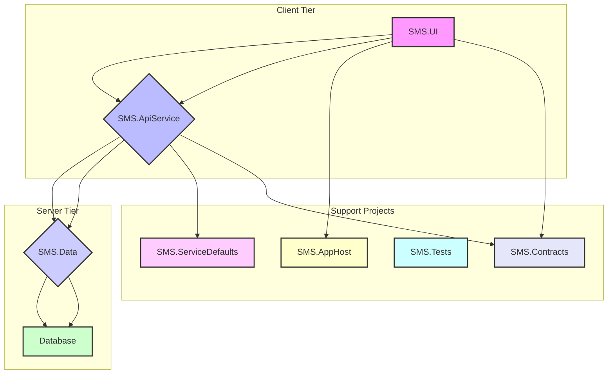
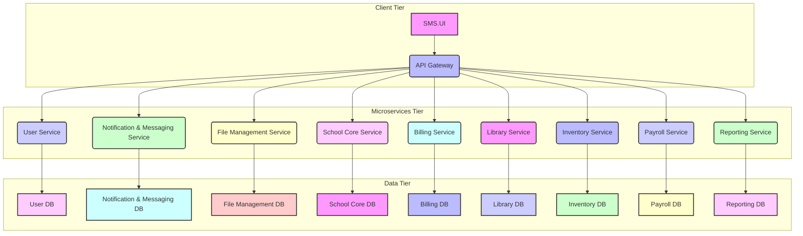

# System Design Document: School Management System (SMS)

**Document Version:** 2.14
**Date:** 2025-08-13
**Author:** Gemini CLI Agent

---

## 1. Introduction

This System Design Document (SDD) provides a detailed technical blueprint for the School Management System (SMS). It elaborates on the architectural choices, component interactions, data flow, and technology stack, offering a comprehensive understanding of how the system will be constructed to meet the requirements outlined in the Software Requirements Specification (SRS). This document is intended for developers, architects, and technical stakeholders involved in the project.

## 2. System Architecture

The SMS will adopt a multi-project architecture centered around .NET MAUI and ASP.NET Core. This structure promotes a clear separation of concerns, enhances maintainability, and facilitates parallel development.

### 2.1. High-Level Architecture Diagram

### 2.2. Architectural Components

- **SMS.UI:**
  - The main client application for all platforms (Android, iOS, macOS, Windows, and Web).
  - It is a Blazor project containing all the UI components, views, and pages.

- **SMS.ApiService:**
  - An ASP.NET Core Web API project that exposes the application's functionality through RESTful endpoints.
  - It contains the business logic and acts as a bridge between the UI and the data layer.

- **SMS.Data:**
  - A .NET library responsible for data access.
  - It contains the Entity Framework Core DbContext, migrations, and data models.

- **SMS.AppHost:**
  - The main application host project that orchestrates the different services.

- **SMS.ServiceDefaults:**
  - A project containing default service configurations and extensions.

- **SMS.Tests:**
  - A project for unit and integration tests.

- **SMS.Contracts:**
  - A .NET class library containing Data Transfer Objects (DTOs) and interfaces that define the contracts between the `SMS.UI` and `SMS.ApiService`.

- **Database:**
  - The primary data store for the application (e.g., PostgreSQL, SQL Server).

### 2.3. Data Flow and Interaction

1.  **Client Interaction:** A user interacts with the `SMS.UI` application.
2.  **API Request:** The `SMS.UI` application makes a request to the `SMS.ApiService` using DTOs defined in `SMS.Contracts`.
3.  **Business Logic:** The `SMS.ApiService` processes the request, using DTOs from `SMS.Contracts` for input and output.
4.  **Data Access:** The `SMS.ApiService` interacts with the `Database` primarily through `SMS.Data` using Entity Framework Core for simple CRUD operations. For complex queries and reporting needs, Dapper will be used directly within the `SMS.ApiService` to execute raw SQL queries for optimal performance.
5.  **API Response:** The `SMS.ApiService` returns a response to the `SMS.UI` application, using DTOs from `SMS.Contracts`.
6.  **UI Update:** The `SMS.UI` application updates the UI based on the response from the API.

## 3. Data Model

The data models are defined in the `SMS.Data` project as Plain Old CLR Objects (POCOs). These models represent the entities in the system and are used for data transfer between the different layers of the application. The core entities are:

### 3.1. Entity Identification Strategy

To balance efficient internal database operations with secure and unique external identification, the following strategy will be employed:

-   **Internal Primary Key (`int Id`):** All entities will use an `int` type for their primary key (`Id`). This provides optimal performance for database indexing, relationships, and storage.
-   **External-Facing Identity (`Guid ExternalId`):
    -   Each entity will also include a `Guid` property named `ExternalId`. This `Guid` will serve as the public-facing identifier for the entity when exposed through APIs, URLs, or user interfaces. Using `Guid` for external identification offers several benefits:
        -   **Uniqueness:** `Guid` values are globally unique, preventing collisions across different systems or instances.
        -   **Security:** It obfuscates the internal sequential `int` IDs, making it harder for malicious users to guess or enumerate records.
        -   **Distributed Systems:** Facilitates easier data merging and synchronization in distributed environments without ID conflicts.

### 3.2. Metadata Properties

All entities will include the following metadata properties for auditing and tracking purposes:

- `CreatedAt` (DateTime): The date and time when the entity was created.
- `UpdatedAt` (DateTime): The date and time when the entity was last updated.
- `CreatedBy` (int): The ID of the user who created the entity.
- `UpdatedBy` (int): The ID of the user who last updated the entity.

### 3.3. Core Entities

- **Student:** Represents a student enrolled in the institution.
  - `Id` (PK)
  - `ExternalId` (Guid)
  - `FirstName`
  - `LastName`
  - `DateOfBirth`
  - `Gender`
  - `Address`
  - `Phone`
  - `Email`
  - `CreatedAt`
  - `UpdatedAt`
  - `CreatedBy`
  - `UpdatedBy`

- **Teacher:** Represents a teacher employed by the institution.
  - `Id` (PK)
  - `ExternalId` (Guid)
  - `FirstName`
  - `LastName`
  - `Email`
  - `Phone`
  - `CreatedAt`
  - `UpdatedAt`
  - `CreatedBy`
  - `UpdatedBy`

- **Course:** Represents an academic course offered.
  - `Id` (PK)
  - `ExternalId` (Guid)
  - `CourseCode`
  - `Title`
  - `Description`
  - `Credits`
  - `TeacherId` (FK to Teacher)
  - `CreatedAt`
  - `UpdatedAt`
  - `CreatedBy`
  - `UpdatedBy`

- **Enrollment:** Represents a student's enrollment in a specific course.
  - `Id` (PK)
  - `ExternalId` (Guid)
  - `StudentId` (FK to Student)
  - `CourseId` (FK to Course)
  - `EnrollmentDate`
  - `Grade` (Nullable)
  - `CreatedAt`
  - `UpdatedAt`
  - `CreatedBy`
  - `UpdatedBy`

- **User:** Represents a system user with authentication details and role.
  - `Id` (PK)
  - `ExternalId` (Guid)
  - `Username`
  - `PasswordHash`
  - `Salt`
  - `RoleId` (FK to Role)
  - `CreatedAt`
  - `UpdatedAt`
  - `CreatedBy`
  - `UpdatedBy`

- **Role:** Defines system roles and their permissions.
  - `Id` (PK)
  - `ExternalId` (Guid)
  - `Name` (e.g., Administrator, Teacher, Student, Parent)
  - `CreatedAt`
  - `UpdatedAt`
  - `CreatedBy`
  - `UpdatedBy`

- **Parent/Guardian:** Represents a parent or guardian linked to one or more students.
  - `Id` (PK)
  - `ExternalId` (Guid)
  - `FirstName`
  - `LastName`
  - `Email`
  - `Phone`
  - `CreatedAt`
  - `UpdatedAt`
  - `CreatedBy`
  - `UpdatedBy`

- **Attendance:** Tracks student attendance records.
  - `Id` (PK)
  - `ExternalId` (Guid)
  - `StudentId` (FK to Student)
  - `Date`
  - `Status` (Present, Absent, Late, Excused)
  - `Notes`
  - `CreatedAt`
  - `UpdatedAt`
  - `CreatedBy`
  - `UpdatedBy`

- **Assignment:** Represents assignments posted by teachers.
  - `Id` (PK)
  - `ExternalId` (Guid)
  - `CourseId` (FK to Course)
  - `Title`
  - `Description`
  - `DueDate`
  - `CreatedAt`
  - `UpdatedAt`
  - `CreatedBy`
  - `UpdatedBy`

- **AssignmentSubmission:** Represents student submissions for assignments.
  - `Id` (PK)
  - `ExternalId` (Guid)
  - `AssignmentId` (FK to Assignment)
  - `StudentId` (FK to Student)
  - `FileId` (FK to FileStorage)
  - `SubmittedAt`
  - `CreatedAt`
  - `UpdatedAt`
  - `CreatedBy`
  - `UpdatedBy`

- **Message:** Internal messages between users.
  - `Id` (PK)
  - `ExternalId` (Guid)
  - `SenderId` (FK to User)
  - `RecipientId` (FK to User)
  - `Content`
  - `SentAt`
  - `IsRead`
  - `CreatedAt`
  - `UpdatedAt`
  - `CreatedBy`
  - `UpdatedBy`

- **Announcement:** System-wide announcements.
  - `Id` (PK)
  - `ExternalId` (Guid)
  - `Title`
  - `Content`
  - `PublishDate`
  - `ExpiryDate`
  - `TargetAudience`
  - `CreatedAt`
  - `UpdatedAt`
  - `CreatedBy`
  - `UpdatedBy`

- **Notification:** Notifications sent to users.
  - `Id` (PK)
  - `ExternalId` (Guid)
  - `UserId` (FK to User)
  - `Content`
  - `Type`
  - `IsRead`
  - `CreatedAt`

- **FileStorage:** Metadata for uploaded files.
  - `Id` (PK)
  - `ExternalId` (Guid)
  - `FileName`
  - `FilePath`
  - `UploadedBy` (FK to User)
  - `UploadedAt`
  - `CreatedAt`
  - `UpdatedAt`
  - `CreatedBy`
  - `UpdatedBy`

- **AuditLog:** Tracks changes to critical data for auditing.
  - `Id` (PK)
  - `ExternalId` (Guid)
  - `UserId` (FK to User)
  - `Action`
  - `Entity`
  - `EntityId`
  - `Timestamp`
  - `Details`

- **Invoice:** Represents a bill for a student.
  - `Id` (PK)
  - `ExternalId` (Guid)
  - `StudentId` (FK to Student)
  - `Amount`
  - `DueDate`
  - `PaidDate` (Nullable)
  - `CreatedAt`
  - `UpdatedAt`
  - `CreatedBy`
  - `UpdatedBy`

- **InvoiceItem:** Represents a single item on an invoice.
  - `Id` (PK)
  - `ExternalId` (Guid)
  - `InvoiceId` (FK to Invoice)
  - `Description`
  - `Amount`
  - `CreatedAt`
  - `UpdatedAt`
  - `CreatedBy`
  - `UpdatedBy`

- **Payment:** Represents a payment made by a student.
  - `Id` (PK)
  - `ExternalId` (Guid)
  - `InvoiceId` (FK to Invoice)
  - `Amount`
  - `PaymentDate`
  - `CreatedAt`
  - `UpdatedAt`
  - `CreatedBy`
  - `UpdatedBy`

- **Book:** Represents a book in the library.
  - `Id` (PK)
  - `ExternalId` (Guid)
  - `Title`
  - `Author`
  - `ISBN`
  - `PublishedDate`
  - `Quantity`
  - `CreatedAt`
  - `UpdatedAt`
  - `CreatedBy`
  - `UpdatedBy`

- **BookLoan:** Represents a book loaned to a student.
  - `Id` (PK)
  - `ExternalId` (Guid)
  - `BookId` (FK to Book)
  - `StudentId` (FK to Student)
  - `LoanDate`
  - `ReturnDate` (Nullable)
  - `DueDate`
  - `CreatedAt`
  - `UpdatedAt`
  - `CreatedBy`
  - `UpdatedBy`

- **InventoryItem:** Represents an item in the school's inventory.
  - `Id` (PK)
  - `ExternalId` (Guid)
  - `Name`
  - `Description`
  - `Quantity`
  - `PurchaseDate`
  - `PurchasePrice`
  - `CreatedAt`
  - `UpdatedAt`
  - `CreatedBy`
  - `UpdatedBy`

- **Salary:** Represents a teacher's salary.
  - `Id` (PK)
  - `ExternalId` (Guid)
  - `TeacherId` (FK to Teacher)
  - `Amount`
  - `EffectiveDate`
  - `CreatedAt`
  - `UpdatedAt`
  - `CreatedBy`
  - `UpdatedBy`

- **Bonus:** Represents a bonus given to a teacher.
  - `Id` (PK)
  - `ExternalId` (Guid)
  - `TeacherId` (FK to Teacher)
  - `Amount`
  - `BonusDate`
  - `CreatedAt`
  - `UpdatedAt`
  - `CreatedBy`
  - `UpdatedBy`

- **Deduction:** Represents a deduction from a teacher's salary.
  - `Id` (PK)
  - `ExternalId` (Guid)
  - `TeacherId` (FK to Teacher)
  - `Amount`
  - `DeductionDate`
  - `CreatedAt`
  - `UpdatedAt`
  - `CreatedBy`
  - `UpdatedBy`

- **Report:** Represents a generated report.
  - `Id` (PK)
  - `ExternalId` (Guid)
  - `Name`
  - `Description`
  - `Query`
  - `CreatedAt`
  - `UpdatedAt`
  - `CreatedBy`
  - `UpdatedBy`

_(A detailed Entity-Relationship Diagram (ERD) will be provided in the Database Schema Document.)_

## 4. Technology Stack

- **Client Framework:** .NET MAUI, Blazor
- **API Framework:** ASP.NET Core
- **Database:** PostgreSQL (or other relational database)
- **ORM:** Entity Framework Core
- **Micro-ORM:** Dapper

## 5. Development Environment Setup

- **IDE:** Visual Studio 2022 (latest version) with .NET MAUI and ASP.NET workloads installed.
- **.NET SDK:** .NET 8 SDK (or later).
- **Git:** For version control.
- **Database Client:** pgAdmin (for PostgreSQL) or other relevant client.

## 6. Deployment Strategy

- **Client Application (`SMS.UI`):** Deployed to the respective app stores (Google Play, Apple App Store, Microsoft Store) or as a web application.
- **API Project (`SMS.ApiService`):** Deployed to a cloud provider like Azure or AWS.

## 7. Security Considerations

- **Authentication & Authorization:** Implemented in the `SMS.ApiService` using ASP.NET Core Identity.
- **Data Encryption:** All sensitive data will be encrypted in transit (HTTPS/TLS) and at rest.
- **Input Validation:** Performed in the `SMS.ApiService` to prevent injection attacks.

## 8. Future Enhancements

- Integration with external services.
- Advanced reporting and analytics.
- Mobile push notifications.

## 9. Microservices Architecture Implementation

Transitioning the SMS to a microservices architecture involves decomposing the current monolithic API into smaller, independently deployable services. This section details the implementation strategy, communication patterns, security considerations, and common infrastructure components.

### 9.1. High-Level Microservices Architecture Diagram

### 9.2. Microservice Breakdown and Responsibilities

Each microservice will be an independent ASP.NET Core Web API project, deployed as a separate unit. They will manage their own data stores and expose well-defined RESTful APIs.

-   **User Service (`SMS.Microservices.User`):**
    -   **Responsibilities:** User authentication (login, registration, password reset), authorization (role management, permissions), user profile management.
    -   **Entities:** `User`, `Role`.
    -   **Technology Stack:** ASP.NET Core, Entity Framework Core, PostgreSQL.
    -   **Key NuGet Packages:** `Microsoft.AspNetCore.Identity.EntityFrameworkCore`, `Npgsql.EntityFrameworkCore.PostgreSQL`, `FluentValidation.AspNetCore`.

-   **Notification & Messaging Service (`SMS.Microservices.NotificationMessaging`):**
    -   **Responsibilities:** Sending in-app notifications, managing internal messages between users, handling announcements.
    -   **Entities:** `Message`, `Notification`, `Announcement`.
    -   **Technology Stack:** ASP.NET Core, Entity Framework Core, PostgreSQL, potentially a message broker (e.g., RabbitMQ, Kafka) for asynchronous notifications.
    -   **Key NuGet Packages:** `Npgsql.EntityFrameworkCore.PostgreSQL`, `FluentValidation.AspNetCore`, `MassTransit` (for message broker integration).

-   **File Management Service (`SMS.Microservices.FileManagement`):**
    -   **Responsibilities:** A generic and reusable solution for managing files and their metadata. It is designed to be integrated into any project requiring robust file handling capabilities.
    -   **Entities:** `FileStorage`.
    -   **Technology Stack:** ASP.NET Core, Entity Framework Core, PostgreSQL, Cloud Storage SDKs (e.g., `Azure.Storage.Blobs`, `AWSSDK.S3`).
    -   **Key NuGet Packages:** `Npgsql.EntityFrameworkCore.PostgreSQL`, `FluentValidation.AspNetCore`, relevant cloud storage SDK.

-   **School Core Service (`SMS.Microservices.SchoolCore`):**
    -   **Responsibilities:** Manages all core academic and administrative data: student information, teacher details, course definitions, enrollments, attendance, assignments, and audit logs.
    -   **Entities:** `Student`, `ParentGuardian`, `Teacher`, `Course`, `Enrollment`, `Attendance`, `Assignment`, `AssignmentSubmission`, `AuditLog`.
    -   **Technology Stack:** ASP.NET Core, Entity Framework Core, PostgreSQL, Dapper (for complex queries).
    -   **Key NuGet Packages:** `Npgsql.EntityFrameworkCore.PostgreSQL`, `FluentValidation.AspNetCore`, `Dapper`.

-   **Billing Service (`SMS.Microservices.Billing`):**
    -   **Responsibilities:** Manages student billing, invoicing, and payments.
    -   **Entities:** `Invoice`, `InvoiceItem`, `Payment`.
    -   **Technology Stack:** ASP.NET Core, Entity Framework Core, PostgreSQL.
    -   **Key NuGet Packages:** `Npgsql.EntityFrameworkCore.PostgreSQL`, `FluentValidation.AspNetCore`.

-   **Library Service (`SMS.Microservices.Library`):**
    -   **Responsibilities:** Manages the school library, including books and loans.
    -   **Entities:** `Book`, `BookLoan`.
    -   **Technology Stack:** ASP.NET Core, Entity Framework Core, PostgreSQL.
    -   **Key NuGet Packages:** `Npgsql.EntityFrameworkCore.PostgreSQL`, `FluentValidation.AspNetCore`.

-   **Inventory Service (`SMS.Microservices.Inventory`):**
    -   **Responsibilities:** Manages the school's inventory of assets.
    -   **Entities:** `InventoryItem`.
    -   **Technology Stack:** ASP.NET Core, Entity Framework Core, PostgreSQL.
    -   **Key NuGet Packages:** `Npgsql.EntityFrameworkCore.PostgreSQL`, `FluentValidation.AspNetCore`.

-   **Payroll Service (`SMS.Microservices.Payroll`):**
    -   **Responsibilities:** Manages teacher salaries, bonuses, and deductions.
    -   **Entities:** `Salary`, `Bonus`, `Deduction`.
    -   **Technology Stack:** ASP.NET Core, Entity Framework Core, PostgreSQL.
    -   **Key NuGet Packages:** `Npgsql.EntityFrameworkCore.PostgreSQL`, `FluentValidation.AspNetCore`.

-   **Reporting Service (`SMS.Microservices.Reporting`):**
    -   **Responsibilities:** Generates and manages reports.
    -   **Entities:** `Report`.
    -   **Technology Stack:** ASP.NET Core, Dapper, PostgreSQL.
    -   **Key NuGet Packages:** `Dapper`, `Npgsql`.

### 9.3. Communication Strategy

Microservices will communicate using a combination of synchronous and asynchronous patterns:

-   **Synchronous Communication (REST over HTTPS):**
    -   **Purpose:** For direct requests where an immediate response is required (e.g., `SMS.UI` calling a microservice via API Gateway, or one microservice requesting data from another).
    -   **Mechanism:** Standard RESTful API calls using HTTP/S. All internal service-to-service communication will also be secured with mTLS (Mutual TLS) where possible.
    -   **Implementation:** `HttpClient` in .NET. Consider using Polly for transient fault handling (retries, circuit breakers).
    -   **Required Packages:** `Microsoft.Extensions.Http.Polly`.

-   **Asynchronous Communication (Message Broker):**
    -   **Purpose:** For events, notifications, and long-running processes where an immediate response is not required, or to decouple services (e.g., a new student registered event triggering a welcome email via Notification & Messaging Service).
    -   **Mechanism:** A message broker (e.g., RabbitMQ, Kafka). Services publish events to topics/queues, and other services subscribe to consume them.
    -   **Implementation:** `MassTransit` or `Confluent.Kafka` for .NET.
    -   **Required Packages:** `MassTransit.RabbitMQ` or `Confluent.Kafka`.

### 9.4. Security Implementation

Security will be a multi-layered approach:

-   **API Gateway Authentication:** The API Gateway will be responsible for authenticating incoming requests from `SMS.UI`. This will likely involve JWT (JSON Web Token) validation.
    -   **Mechanism:** OAuth 2.0 / OpenID Connect flow. The User Service will act as the Identity Provider.
    -   **Implementation:** `IdentityServer4` (or `Duende IdentityServer`) or `Microsoft.AspNetCore.Authentication.JwtBearer` at the API Gateway.
    -   **Required Packages:** `Microsoft.AspNetCore.Authentication.JwtBearer`.

-   **Service-to-Service Authorization (JWT Propagation):** Once authenticated at the Gateway, the JWT will be propagated to downstream microservices. Each microservice will validate the JWT and perform its own authorization checks based on roles and claims within the token.
    -   **Mechanism:** Policy-based authorization in ASP.NET Core.

-   **Mutual TLS (mTLS):** For critical internal service-to-service communication, mTLS will be implemented to ensure both client and server authenticate each other using certificates.
    -   **Implementation:** Configured at the network/infrastructure level (e.g., Kubernetes, service mesh) or via `HttpClient` and Kestrel configurations.

-   **Input Validation:** As defined in `SMS.Contracts` using FluentValidation, applied at the entry point of each microservice API.

### 9.5. Data Management and Consistency

Each microservice will own its data, promoting autonomy and decoupling. Data consistency across services will be handled using eventual consistency patterns:

-   **Polyglot Persistence:** Each service can choose the database technology best suited for its needs (e.g., PostgreSQL for relational data, MongoDB for document data).
-   **Event-Driven Architecture (EDA) / Sagas:** For complex business transactions spanning multiple services, Sagas will be implemented using the message broker. Services publish events upon completing their part of a transaction, and other services react to these events.
    -   **Implementation:** Orchestration or Choreography patterns with `MassTransit`.

### 9.6. Common Infrastructure and Cross-Cutting Concerns

-   **API Gateway:** (e.g., Ocelot, Azure API Management, AWS API Gateway) Acts as a single entry point, handling request routing, authentication, rate limiting, and caching.
    -   **Required Packages:** `Ocelot` (if self-hosted).
    -   **Monitoring:** The API Gateway will expose metrics and logs that can be collected by monitoring systems (e.g., Prometheus, Grafana). This includes request counts, response times, and error rates.
    -   **Caching:** Ocelot's built-in caching mechanism will be utilized to cache responses from downstream services, reducing load on microservices and improving response times for clients. Caching policies can be configured per route.
    -   **Rate Limiting:** Ocelot's rate limiting features will be configured to protect microservices from excessive requests and ensure fair usage. This can be applied globally or per route, with options for client whitelisting and various time periods.

-   **Service Discovery:** (e.g., Consul, Eureka, Kubernetes DNS) Allows microservices to find and communicate with each other dynamically without hardcoding addresses.
    -   **Implementation:** Integrated with `SMS.AppHost` and deployment environment.

-   **Centralized Logging:** Aggregates logs from all microservices for easier monitoring and troubleshooting.
    -   **Implementation:** Serilog with sinks to a centralized log management system (e.g., ELK Stack, Azure Monitor, AWS CloudWatch).
    -   **Required Packages:** `Serilog.AspNetCore`, `Serilog.Sinks.Console`, `Serilog.Sinks.Seq` (or other relevant sink).

-   **Distributed Tracing:** Tracks requests as they flow through multiple microservices, aiding in performance analysis and debugging.
    -   **Implementation:** OpenTelemetry with exporters to a tracing system (e.g., Jaeger, Zipkin, Azure Application Insights).
    -   **Required Packages:** `OpenTelemetry.Exporter.Jaeger`, `OpenTelemetry.Extensions.Hosting`.

-   **Monitoring & Alerting:** Collects metrics from services and infrastructure to provide insights into system health and performance.
    -   **Implementation:** Prometheus/Grafana, Azure Monitor, AWS CloudWatch.

### 9.7. Role of Existing Projects in a Microservices Context (Refined)

-   **`SMS.UI`:** Remains the client application, interacting with the API Gateway.
-   **`SMS.ApiService` (Decomposition):** Its current responsibilities are distributed among the four new microservices (`SMS.Microservices.User`, `SMS.Microservices.NotificationMessaging`, `SMS.Microservices.FileManagement`, `SMS.Microservices.SchoolCore`).
-   **`SMS.Data` (Decomposition):** The data models and `DbContext` are now specific to each microservice, residing within their respective projects. The `SMS.Data` project itself might be refactored into smaller, service-specific data access libraries or its contents directly integrated into each microservice project.
-   **`SMS.Contracts`:** This project would be decomposed into smaller, service-specific contract libraries (e.g., `SMS.Contracts.User`, `SMS.Contracts.SchoolCore`), defining the DTOs for each microservice. This ensures strict API contracts between services and their consumers.
-   **`SMS.AppHost`:** Becomes the orchestrator for local development and deployment, managing the startup and interconnections of the microservices.
-   **`SMS.ServiceDefaults`:** Continues to provide common configurations, health checks, and potentially shared utility code for all microservices.
-   **`SMS.Tests`:** Expands to include dedicated test projects for each microservice (unit, integration) and end-to-end tests for the overall system.

This detailed implementation strategy provides a robust framework for building a scalable and resilient microservices architecture for the SMS.
